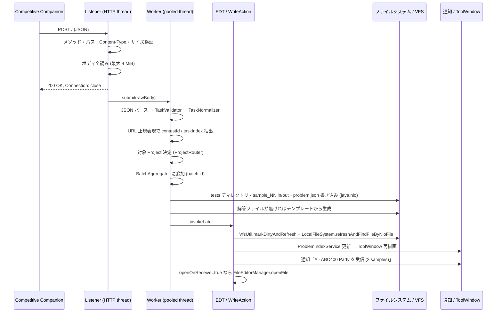

# PyCharm 用 Competitive Companion 連携プラグイン 仕様書（AtCoder 対応）

- 文書バージョン: 0.1（2026-09-19）
- ステータス: ドラフト（実装前の設計）
- 対象読者: 本プラグインの実装者・レビュアー
- 調査対象バージョン: Competitive Companion v2.65.0（`master` ブランチ、2026-09-19 時点）/ AtCoder 利用規約（2026-06-29 改定版）/ AtCoder 生成AI対策ルール 20251003 版

---

## 目次

1. [目的とスコープ](#1-目的とスコープ)
2. [用語](#2-用語)
3. [前提調査: Competitive Companion の仕組み](#3-前提調査-competitive-companion-の仕組み)
4. [AtCoder 利用規約・ルールとの適合性](#4-atcoder-利用規約ルールとの適合性)
5. [全体アーキテクチャ](#5-全体アーキテクチャ)
6. [HTTP リスナー仕様](#6-http-リスナー仕様)
7. [受信 JSON の検証と正規化](#7-受信-json-の検証と正規化)
8. [URL からの ID 抽出規則](#8-url-からの-id-抽出規則)
9. [ファイル配置とテンプレート](#9-ファイル配置とテンプレート)
10. [テスト実行エンジン](#10-テスト実行エンジン)
11. [UI 仕様](#11-ui-仕様)
12. [永続化データ仕様](#12-永続化データ仕様)
13. [プラグイン技術スタックとプロジェクト構成](#13-プラグイン技術スタックとプロジェクト構成)
14. [エラー処理一覧](#14-エラー処理一覧)
15. [テスト計画と受け入れ基準](#15-テスト計画と受け入れ基準)
16. [ロードマップ](#16-ロードマップ)
17. [未決事項（要判断）](#17-未決事項要判断)
18. [参考リンク](#18-参考リンク)

---

## 1. 目的とスコープ

### 1.1 目的

ブラウザ拡張 [Competitive Companion](https://github.com/jmerle/competitive-companion) が送信する問題データ（問題名・URL・制限・サンプル入出力）を PyCharm 内で受信し、

1. 解答用 Python ファイルとサンプルテストをプロジェクト内に自動生成し、
2. プロジェクトの Python インタプリタでサンプルテストを一括実行して AC / WA / RE / TLE を判定し、
3. 期待出力との差分を PyCharm の Diff ビューアで表示する

ことで、AtCoder の問題を「ブラウザで開く → 拡張のボタンを 1 回押す → PyCharm で書いてテストする」の流れで解けるようにする。

### 1.2 スコープ（v1.0）

| 項目 | 含む | 備考 |
|---|---|---|
| Competitive Companion からの受信（単一問題） | ✔ | 問題ページで拡張ボタンを押した場合 |
| Competitive Companion からの受信（コンテスト一括） | ✔ | `/contests/<id>/tasks` ページで Contest parser を使った場合。`batch` でグルーピング |
| AtCoder の URL 解釈（コンテスト ID / 問題 ID の抽出） | ✔ | 8 章 |
| 解答ファイル・テストファイルの生成 | ✔ | 9 章 |
| Python（CPython / PyPy）でのテスト実行と判定 | ✔ | 10 章 |
| ツールウィンドウ・通知・ステータスバー・設定画面 | ✔ | 11 章 |
| 期待出力との Diff 表示 | ✔ | IntelliJ の `DiffManager` |
| ユーザー独自テストケースの追加・編集 | ✔ | |
| AtCoder 以外のジャッジ（Codeforces 等） | ✘ | 受信しても無視して通知のみ。v1.1 で汎用モードを検討 |
| AtCoder への提出自動化 / ログイン | ✘ | 提出ページをブラウザで開くだけ。理由は 4.6 節 |
| 問題文本文の取得・表示 | ✘ | Competitive Companion は問題文を送らない。プラグインも atcoder.jp にアクセスしない |
| インタラクティブ問題のジャッジ実行 | ✘ | `interactive: true` は警告表示のみ。v1.x でジャッジスクリプト対応を検討 |
| メモリ制限の計測 | ✘ | クロスプラットフォームで正確に取れないため v1 では非対応 |
| 生成 AI 機能（補完・要約・解説） | ✘ | 4.4 節のルール上、意図的に一切実装しない |

### 1.3 設計原則

1. **プラグイン自身は atcoder.jp に一切 HTTP リクエストを送らない。** ネットワーク I/O は `127.0.0.1` での受信のみ。
2. **受信データは信頼しない。** ローカルの任意プロセス・任意 Web ページが `localhost` に POST できるため、JSON を検証し、ファイルパスは URL の正規表現マッチ結果からのみ生成する。
3. **Competitive Companion の応答期限（既定 500 ms）内に必ず 200 を返す。** 重い処理は応答後にバックグラウンドで行う。
4. **既存の解答ファイルを上書きしない。** 再受信時はサンプルテストのみ更新する。
5. **AI 機能を持たない。** 「ルールベースで問題を解析しサンプルを書き出すツール」の範囲に留める（4.4 節）。

---

## 2. 用語

| 用語 | 意味 |
|---|---|
| CC | Competitive Companion（ブラウザ拡張） |
| Problem parser | CC の、単一問題ページを解析するパーサ（AtCoder では `AtCoderProblemParser`） |
| Contest parser | CC の、問題一覧ページから全問題を解析するパーサ（`AtCoderContestParser`） |
| Task | CC が送る 1 問題分の JSON オブジェクト |
| Batch | CC の JSON 内 `batch` フィールド。同じ `batch.id` を持つ Task 群が 1 コンテスト分 |
| contestId | AtCoder URL の `/contests/<contestId>/` 部分（例: `abc400`） |
| taskId | AtCoder URL の `/tasks/<taskId>` 部分（例: `abc400_a`） |
| taskIndex | taskId の末尾サフィックス（例: `a`）。ファイル名に使う |
| サンプルテスト | CC 経由で受信した公式サンプル。ファイル名 `sample_NN.{in,out}` |
| カスタムテスト | ユーザーが手で追加したテスト。ファイル名 `custom_NN.{in,out}` |
| 判定（Verdict） | `AC` / `WA` / `RE` / `TLE` / `IE` / `MANUAL` / `SKIP` |

---

## 3. 前提調査: Competitive Companion の仕組み

以下は v2.65.0 のソース（`src/` 配下）を読んで確認した事実である。

### 3.1 動作フロー（Problem parser）

1. ユーザーが AtCoder の問題ページ（`https://atcoder.jp/contests/*/tasks/*`）を開き、拡張のツールバーアイコン（緑の「+」）をクリックする。
2. `background.ts` の `loadContentScript()` が `browser.permissions.request({ origins: ['http://localhost/'] })` で localhost への送信権限を要求（初回のみダイアログ）し、`js/content.js` をタブに注入する。
3. `content.ts` の `getParserToUse()` が `window.location.href` に対して各パーサの `getMatchPatterns()`（AtCoder は `'https://atcoder.jp/contests/*/tasks/*'`）と `canHandlePage()` を照合し、パーサを決定する。
4. `parser.parse(window.location.href, document.documentElement.outerHTML)` を呼ぶ。**すでに表示されている DOM を解析するだけで、追加の HTTP リクエストは発生しない。**
5. 生成された `Task` の `send()` が background にメッセージを送り、`sendTask()` が `getHosts()` の全ホストに対して並列（`p-limit(6)`）に POST する。
6. 各 POST は `AbortController` により `requestTimeout`（既定 **500 ms**、拡張のオプション画面で変更可）で中断される。エラーは握りつぶされ、ユーザーには何も表示されない。

### 3.2 動作フロー（Contest parser）

1. ユーザーが問題一覧ページ（`https://atcoder.jp/contests/*/tasks`）で拡張アイコンをクリックする。
2. `AtCoderContestParser`（`SimpleContestParser` を継承）が `table tr td:first-child a` の `href` を全て集める。
3. `ContestParser.parse()` が各 URL について `parseTask()` を **`Promise.all` で並列に**呼ぶ。`parseTask()` は `utils/request.ts` の `request(url)` で問題ページを `fetch(url, { credentials: 'include' })` により取得する（ログイン Cookie 付き。ヘッダ `X-Competitive-Companion: <version>` を付与）。
4. `request()` は非 200 応答時に最大 3 回リトライし、待機時間は `2000 - 500 * retries` ms（500 → 1000 → 1500 ms）。コメントに「Some judges don't like it if we send 10+ parallel requests」とある。
5. 全 Task を `Contest` にまとめ、`batch.id` を先頭 Task の UUID に統一、`batch.size` を問題数に設定し、**Task ごとに順番に（`for … await`）POST する。** つまり 7 問なら 7 回の独立した POST が届く。

### 3.3 送信先ホストと HTTP 仕様

`src/hosts/hosts.ts`（v2.65.0）:

```ts
const defaultHosts: Host[] = [new CHelperHost()];
const defaultPorts = [
  1327, // cpbooster
  4244, // Hightail
  6174, // Mind Sport
  10042, // acmX
  10043, // Caide and AI Virtual Assistant
  10045, // CP Editor
  27121, // Competitive Programming Helper
];

export async function getHosts(): Promise<Host[]> {
  const customPorts = await config.get('customPorts');
  const uniquePorts = [...new Set(defaultPorts.concat(customPorts))];
  return defaultHosts.concat(uniquePorts.map(port => new CustomHost(port)));
}
```

- `CustomHost.send()`: `POST http://localhost:<port>/`、ヘッダ `Content-Type: application/json`、ボディは `JSON.stringify(task)`。
- `CHelperHost.send()`: `POST http://localhost:4243/`、Content-Type なし、ボディは `"json\n" + JSON`（CHelper 専用形式。本プラグインでは扱わない）。
- 拡張のオプション画面「Custom ports」に追加したポートにも同じ形式で送られる。**本プラグインのポートは既定リストにないため、ユーザーが Custom ports に追加する必要がある**（初回セットアップ手順として README に記載する）。
- 全ホストに同時送信されるため、他ツール（VS Code の CPH 等）が同時に動いていても互いに干渉しない。

### 3.4 AtCoder パーサの抽出ロジック（`AtCoderProblemParser.ts`）

| フィールド | 抽出方法 | abc400_a での実値 |
|---|---|---|
| `name` | `h2, .h2` の**テキストノードのみ**を連結して `trim()`（`<a>Editorial</a>` 等の子要素は除外） | `"A - ABC400 Party"` |
| `group` | `"AtCoder - " + (.contest-name, .contest-title の textContent)` | `"AtCoder - AtCoder Beginner Contest 400"` |
| `url` | `window.location.href` そのまま（クエリ `?lang=ja` 等が付くことがある） | `"https://atcoder.jp/contests/abc400/tasks/abc400_a"` |
| `interactive` | HTML に `'This is an interactive task'` または `'This is a reactive problem'` を含むか | `false` |
| `timeLimit` | `#task-statement` の直前要素のテキストから `/([0-9.]+) ?sec/` → ×1000 → `Math.floor` | `2000`（`Time Limit: 2 sec`） |
| `memoryLimit` | 同テキストから `/(\d+) ?Mi?B/` | `1024`（`Memory Limit: 1024 MiB`） |
| `tests` | `h3` のうち textContent に `入力例` / `出力例` を含むものの次要素（`pre`）の `textContent` を対にする | `[{input:"10\n", output:"40\n"}]` |

注意点:

- `入力例` / `出力例` は**日本語版の見出し**を探している。英語のみの古い問題では `tests` が空配列になる。プラグインは空配列を正常系として扱う（9.4 節）。
- `Test` クラス（`models/Test.ts`）で正規化される: `<br>` → `\n`、`&nbsp;` 除去、各行の末尾空白 `trimEnd()`、全体の末尾空白除去、**末尾に `\n` を必ず 1 つ付与**（空文字列の場合は付与しない）。
- `testType` は常に `"single"`、`input`/`output` は `{type:"stdin"}` / `{type:"stdout"}`、`languages.java.taskClass` は `name` から生成される（例: `"AABC400Party"`）。プラグインはこれらを無視してよい。

### 3.5 受信 JSON の例（AtCoder abc400_a）

```json
{
  "name": "A - ABC400 Party",
  "group": "AtCoder - AtCoder Beginner Contest 400",
  "url": "https://atcoder.jp/contests/abc400/tasks/abc400_a",
  "interactive": false,
  "memoryLimit": 1024,
  "timeLimit": 2000,
  "tests": [
    { "input": "10\n", "output": "40\n" },
    { "input": "7\n", "output": "-1\n" }
  ],
  "testType": "single",
  "input": { "type": "stdin" },
  "output": { "type": "stdout" },
  "languages": { "java": { "mainClass": "Main", "taskClass": "AABC400Party" } },
  "batch": { "id": "123e67c8-03c6-44a4-a3f9-5918533f9fb2", "size": 1 }
}
```

### 3.6 プラグイン設計に効く制約のまとめ

| 制約 | 出典 | プラグインでの対応 |
|---|---|---|
| 応答待ちは既定 500 ms で abort | `Host.doSend()` + `config.requestTimeout` | ボディ読み取り後、即 200 を返す。ファイル生成は応答後に非同期実行 |
| 失敗してもユーザーに通知されない | `Host.doSend()` の空 catch | プラグイン側で受信成功／失敗を必ず通知する。ステータスバーで待受状態を常時表示 |
| 送信先は `http://localhost:<port>/`（パスは `/` 固定） | `CustomHost` | `POST /` のみ受け付ける。`/` 以外は 404 |
| コンテスト一括は Task ごとに別 POST | `Contest.send()` | `batch.id` でグルーピングし、`batch.size` 件揃うか 10 秒経過で 1 回だけ通知 |
| 既定ポートにない | `hosts.ts` | 初回セットアップで Custom ports 追加を案内。公開後に CC へポート追加の issue を出す |

---

## 4. AtCoder 利用規約・ルールとの適合性

> 本節は 2026-09-19 時点で公開されている一次資料を読んで整理したものであり、法的助言ではない。最終判断はユーザー自身が行うこと。不明点は AtCoder サポート（https://atcoder.zendesk.com/hc/ja/requests/new）に問い合わせるのが確実。

### 4.1 結論

**本プラグインの設計（3 章の CC + 1.3 節の設計原則）は、AtCoder の利用規約・コンテストルール・生成AI対策ルールのいずれにも抵触しないと判断する。** 根拠は以下。

1. 利用規約にスクレイピング・自動アクセス・外部ツールを禁止する条文は存在しない（4.2）。
2. コンテスト中のルールは「ローカルのエディタを利用した実装」を推奨事項として明記している（4.3）。
3. 生成AI対策ルールは「ルールベースのアルゴリズムによって問題文を解析し、サンプル入出力データをファイルに書き出すツール」を**明示的に許容**している（4.4）。
4. プラグイン自身は atcoder.jp にアクセスしない。CC の Problem parser も表示済み DOM を読むだけで追加リクエストを発生させない（3.1）。
5. `robots.txt` で Disallow されているパス（順位表・提出一覧・質問・`/servertime/`・ユーザー履歴）には CC もプラグインも触れない（4.5）。

### 4.2 利用規約（2026-06-29 改定版）

出典: https://atcoder.jp/tos?lang=ja

「禁止事項」の全文:

> 本サービスの利用に当たって、以下の行為又はそのおそれがある行為を行ってはならないものとします
> - 公序良俗に反する行為
> - 国内法または適用を受ける外国法に抵触する行為
> - 特定または不特定の第三者に著しい不利益をもたらす行為
> - 当サービスに虚偽の情報を申告すること
> - 当サービスまたは弊社に損害を与えるまたは与える恐れのある行為をすること
> - 複数人によるログインIDの共有行為
> - その他、弊社が不適切と判断する行為

評価:

- スクレイピング／自動アクセス／ブラウザ拡張／外部ツールへの言及は**ない**。
- 関係しうるのは「当サービスまたは弊社に損害を与えるまたは与える恐れのある行為」（サーバ負荷）のみ。本プラグインはリクエストを発生させず、CC の Problem parser も追加リクエストを発生させないため該当しない。Contest parser は問題数分の GET を並列に行うが、これは問題タブを人間が一括で開くのと同程度であり、かつ 1 コンテストにつき 1 回限りである。
- 「知的財産権」の条文:
  > 本サービスを構成する文章、画像、プログラムその他のデータ等についての一切の権利（所有権、知的財産権、肖像権、パブリシティー権等）は、ユーザ自身が作成したものを除き、弊社又は当該権利を有する第三者に帰属しています

  サンプル入出力は AtCoder の著作物に当たりうる。プラグインはこれを**ユーザーのローカルに私的利用目的で保存するだけ**であり、再配布・公開はしない。ユーザーが解答リポジトリを公開する場合にサンプルファイルも含まれうる点は README で注意喚起する（既存の競プロツール `oj` / `acc` も同様の運用であり、慣行上問題視されていない）。
- 「利用環境の整備」: 「弊社はユーザの利用環境について一切関与せず、また一切の責任を負いません」— ローカル環境は自由。

### 4.3 コンテスト中のルール

出典: https://info.atcoder.jp/overview/contest/rules

「容認事項」から引用:

> **ローカルのエディタを利用した実装**
> AtCoder上では簡易的なエディタを用意していますが、自分で用意した使いやすい環境において開発することを推奨しております。

> **自動コード作成**
> 一部の開発環境において、コード補完が自動的に行われる環境となっていることがありますが、こちらをオフにする必要はありません。
> 現在は、ABC・ARC・AGCでは生成AIを利用したコンテストへの参加は禁止されていますのでご注意ください。

> **ライセンス上利用可能なソースコードのコピー&ペーストによる利用**
> 事前に自分で用意したコード群をコピー&ペースト・引用してコンテストに利用することは許可されています。

評価: PyCharm でローカル実装すること、テンプレート（ライブラリ）を自動挿入することは容認事項の範囲内。

禁止事項（コンテスト中の問題への言及、他人との協力、複数アカウント）はいずれもプラグインの機能と無関係。プラグインは SNS 投稿・コード共有・ログイン機能を持たない。

### 4.4 生成AI対策ルール（20251003 版）— 最重要

出典: https://info.atcoder.jp/entry/llm-rules-ja （ABC / ARC / AGC 開催中に適用。過去問練習・AHC には非適用）

> 生成AIを使用していない場合はこのルールの対象外です。例えば以下のようなツールの使用は許容されます。
> - **ルールベースのアルゴリズムによって問題文を解析し、サンプル入出力データをファイルに書き出すツール**
> - ルールベースのアルゴリズムによって問題文を解析し、入出力を行うコードを生成するツール

CC（DOM の `h3` / `pre` を CSS セレクタで抽出）＋本プラグイン（JSON をファイルに書き出しテスト実行）は、上記 1 点目そのものである。

一方で以下も引用しておく:

> 生成AIベースのコード補完（例：Copilot）は禁止されます。
> コンテスト参加中は補完機能をオフにして下さい。
> 生成AIベースでない補完機能は許容されます。

> コンパイルエラーやバグの診断に生成AIを使用してはいけません。

プラグイン設計への反映:

| 項目 | 方針 |
|---|---|
| プラグイン内の AI 機能 | **一切実装しない**（要約・解説・補完・エラー診断・翻訳のいずれも） |
| PyCharm の AI Assistant / Junie / Full Line Code Completion | プラグインは制御しない。README に「ABC/ARC/AGC 参加中は各自でオフにすること」を明記。v1.x で「コンテストモード」リマインダ通知を検討（17 章） |
| 実行結果の表示 | 生の stdout / stderr / 終了コード / 経過時間と Diff のみ。エラー内容の解釈・提案はしない |

### 4.5 robots.txt とアクセス制限

`https://atcoder.jp/robots.txt`（2026-09-19 取得）:

```
User-agent: *
Disallow: /contests/*/standings/
Disallow: /contests/*/submissions/
Disallow: /contests/*/clarifications/
Disallow: /submissions/
Disallow: /servertime/
Disallow: /users/*/history/
```

- 問題ページ `/contests/*/tasks/*` と問題一覧 `/contests/*/tasks` は Disallow 対象外。
- robots.txt は本来クローラ向けの指示だが、CC の Contest parser が触るのは問題ページのみで、いずれにせよ Disallow 対象に触れない。

また AtCoder は「コンテストサイトにアクセスしにくい状況について」（https://atcoder.jp/posts/1027）で次のように述べている:

> 詳細は伏せますが、同一IPアドレスからの連続アクセス数を制限しております。

Contest parser はコンテスト開始直後に問題数分の GET を並列に行うため、この制限に当たる可能性がゼロではない（当たった場合 CC 側が 500〜1500 ms 待ってリトライする）。README では **コンテスト本番中は Problem parser（各問題ページで個別にボタンを押す）を推奨**し、Contest parser は過去問練習向けと位置付ける。

### 4.6 提出自動化を v1 で行わない理由

- 提出にはログインセッション（Cookie / CSRF トークン）が必要で、認証情報の保管・送信という別種のリスクを持ち込む。
- 利用規約の「複数人によるログインIDの共有行為」「アカウントを第三者に譲渡又は貸与」に抵触する形の実装（トークン共有等）を避ける設計コストが大きい。
- 既存ツール（`online-judge-tools`, `atcoder-cli`）が自動提出を行っており慣行として黙認されているが、本プラグインは「atcoder.jp に一切アクセスしない」原則を守る方が説明責任上シンプル。
- 代替として「提出ページをブラウザで開く」（`https://atcoder.jp/contests/<contestId>/submit?taskScreenName=<taskId>`）と「解答をクリップボードにコピー」を提供する。

### 4.7 名称・ロゴ

- AtCoder ロゴガイドライン（https://info.atcoder.jp/logoguide）は「AtCoderが公式に承認しているような印象を与えること」「AtCoderと誤認されるサービス」を禁止している。
- 対応: プラグインに AtCoder ロゴを使わない。プラグイン名・説明文に「Unofficial（非公式）」を明記し、AtCoder 株式会社との関係がないことを README と Marketplace 説明文に書く。
- 推奨名称案: `Competitive Companion Runner for PyCharm`（AtCoder の商標を名称に含めない）。AtCoder 対応は説明文で述べる。

### 4.8 遵守チェックリスト（実装・レビュー時に確認）

- [ ] プラグインのコードに `atcoder.jp` への HTTP クライアント呼び出しが存在しない（`grep -r "atcoder.jp" src/` で URL 生成・`BrowserUtil.browse` 以外にヒットしない）
- [ ] 外部 API（LLM 等）呼び出しが存在しない
- [ ] 認証情報を保存・送信しない
- [ ] サンプルテストの保存先はユーザーのプロジェクト内のみ。クラウド同期・テレメトリなし
- [ ] README に「非公式」「AI 機能なし」「コンテスト中は AI 補完をオフに」「本番中は Problem parser 推奨」を記載

---

## 5. 全体アーキテクチャ

### 5.1 コンポーネント図

```mermaid
flowchart LR
  subgraph Browser["ブラウザ (Chrome / Firefox)"]
    AC["atcoder.jp 問題ページ<br/>(表示済み DOM)"]
    CC["Competitive Companion<br/>content.js → background.js"]
    AC -- "DOM 解析のみ" --> CC
  end

  subgraph PyCharm["PyCharm (JVM)"]
    L["CompanionListenerService<br/>(APP level, HttpServer 127.0.0.1:10046)"]
    V["TaskValidator / TaskNormalizer"]
    R["ProjectRouter<br/>(最後にフォーカスされた Project を選択)"]
    B["BatchAggregator<br/>(batch.id ごとに集約)"]
    G["ProblemGenerator<br/>(ファイル生成・index 更新)"]
    S["ProblemIndexService<br/>(PROJECT level, .companion/index.json)"]
    T["TestRunnerService<br/>(PROJECT level)"]
    UI["ToolWindow / Notifications /<br/>StatusBarWidget / Settings / Diff"]
    PY["Python インタプリタ<br/>(Project SDK or custom path)"]
    L --> V --> R --> B --> G --> S
    G --> UI
    UI --> T --> PY
    T --> UI
    S --> UI
  end

  CC -- "POST http://localhost:10046/<br/>Content-Type: application/json" --> L
  L -- "200 OK (< 500 ms)" --> CC
```



### 5.2 受信〜生成のシーケンス



### 5.3 スレッドモデル

| 処理 | スレッド | 理由 |
|---|---|---|
| HTTP 受信・応答 | `HttpServer` 専用スレッド（1 本、`Executors.newSingleThreadExecutor`） | 応答を 500 ms 以内に返すため他処理と分離 |
| JSON 検証・ファイル書き込み | `AppExecutorUtil.getAppExecutorService()` | ブロッキング I/O を EDT から外す |
| VFS リフレッシュ・エディタ操作・通知 | EDT（`ApplicationManager.getApplication().invokeLater`）+ 必要箇所は `WriteAction` | IntelliJ Platform の規約 |
| テスト実行 | `ProgressManager.run(Task.Backgroundable)` 内で `OSProcessHandler` | キャンセル可能・進捗表示 |
| 設定読み書き | 任意（`PersistentStateComponent` はスレッドセーフに使う） | |

---

## 6. HTTP リスナー仕様

### 6.1 実装方式

- `com.sun.net.httpserver.HttpServer`（JBR に含まれる `jdk.httpserver` モジュール）を使用する。IDE 組み込み Web サーバ（`BuiltInServerManager`、ポート 63342〜）は、複数 IDE 起動時にポートが動的に変わり CC 側で固定できないため採用しない。
- アプリケーションレベルのサービス `CompanionListenerService`（`@Service(Service.Level.APP)`）が 1 インスタンスの `HttpServer` を保持する。
- 起動タイミング: `ProjectActivity`（`postStartupActivity`）で最初のプロジェクトが開いたとき。`autoStart=false` の場合はステータスバーからの手動起動のみ。
- 停止タイミング: 最後のプロジェクトが閉じたとき（`ProjectManagerListener.projectClosed`）および IDE 終了時（`Disposable`）。

### 6.2 バインド

| 項目 | 値 |
|---|---|
| アドレス | `127.0.0.1` のみ（`InetSocketAddress("127.0.0.1", port)`）。`0.0.0.0` にはバインドしない |
| ポート（既定） | **10046**（設定で変更可。範囲 1024〜65535） |
| 追加ポート | 設定 `extraPorts`（任意個）。同じハンドラで別 `HttpServer` を立てる。既定は空 |
| backlog | 16 |
| バインド失敗時 | `java.net.BindException` を捕捉 → ステータスバーを赤表示 → 通知「ポート 10046 は使用中です。設定でポートを変更してください」。5 秒後に 1 回だけ再試行 |

### 6.3 リクエスト受理条件

以下の順で検証し、最初に失敗した時点で応答して終了する。

| # | 条件 | 不成立時の応答 |
|---|---|---|
| 1 | メソッドが `POST` | `405 Method Not Allowed`（`Allow: POST`） |
| 2 | パスが `/`（`/` 以外は全て） | `404 Not Found` |
| 3 | `Content-Type` が `application/json`（パラメータ `; charset=utf-8` は許容、大文字小文字無視） | `415 Unsupported Media Type` |
| 4 | `Content-Length` が存在し `<= 4 MiB`（4,194,304 バイト）。存在しない場合はチャンク読みで 4 MiB 超過時に中断 | `413 Payload Too Large` |
| 5 | ボディが UTF-8 としてデコード可能 | `400 Bad Request` |

全条件を満たしたら **`200 OK`、ボディ空、`Connection: close`** を返し、以後の処理はワーカーに委譲する。JSON の構文エラーやスキーマ違反は **200 を返した後**にプラグイン側の通知で報告する（CC は 4xx/5xx を受けてもユーザーに何も表示しないため、HTTP ステータスで報告する意味がない）。

`OPTIONS` へは CORS ヘッダを**返さない**（Web ページからの `fetch` によるプリフライト付きリクエストを成立させないため。6.5 節）。

### 6.4 応答時間目標

- ボディ 4 MiB 上限のもとで、受信開始から 200 応答までを **100 ms 以内**にする（CC 既定 500 ms の 1/5）。
- HTTP スレッドではファイル I/O・VFS・EDT 待ちを一切行わない。

### 6.5 セキュリティ考慮

脅威: ローカルの他プロセス、または開いている任意の Web ページが `http://localhost:10046/` に POST できる。

| 脅威 | 対策 |
|---|---|
| Web ページからの CSRF 的 POST | `Content-Type: application/json` を必須にする。ブラウザは `application/json` を simple request として扱わずプリフライト（`OPTIONS`）を要求し、本サーバは CORS ヘッダを返さないため成立しない。`text/plain` 等は 415 で拒否 |
| パストラバーサル（`name` や `group` にパス文字） | ファイルパスは **URL 正規表現の名前付きグループ（`[A-Za-z0-9_-]+`）からのみ**生成する。`name` / `group` は表示・`problem.json` 内・テンプレート変数（コメント）にのみ使用し、テンプレート挿入時は改行を空白に置換する |
| 巨大ボディ | 4 MiB 上限、テスト数上限 100、1 テストの入力・出力それぞれ 1 MiB 上限 |
| 大量リクエスト | 単一スレッド処理 + ワーカーキュー上限 64。超過分は 200 を返しつつ破棄し、通知を 1 回だけ出す |
| `Origin` ヘッダ検証 | 任意機能（既定オフ）。オンの場合、`Origin` が存在するときは `chrome-extension://` または `moz-extension://` で始まることを要求。Firefox のバックグラウンド fetch では `Origin` が付かない場合があるため既定オフ |
| 外部ネットワークからの到達 | `127.0.0.1` バインドのみで不可 |

### 6.6 ログ

- `com.intellij.openapi.diagnostic.Logger.getInstance("#companion.listener")` を使用。
- INFO: 起動・停止・受理（URL のみ、ボディは出さない）。DEBUG: ボディ先頭 512 文字。WARN: 検証失敗。

---

## 7. 受信 JSON の検証と正規化

### 7.1 データモデル（Kotlin）

```kotlin
data class ReceivedTest(val input: String, val output: String)

data class ReceivedTask(
    val name: String,
    val group: String?,
    val url: String,
    val interactive: Boolean,
    val timeLimitMs: Int,
    val memoryLimitMb: Int,
    val tests: List<ReceivedTest>,
    val batchId: String,
    val batchSize: Int,
    val receivedAt: Instant,
)
```

JSON パーサは IntelliJ Platform に同梱の Gson（`com.google.gson`）または kotlinx.serialization を使用。未知フィールドは無視する。

### 7.2 検証規則

| フィールド | 必須 | 型 | 制約 | 違反時 |
|---|---|---|---|---|
| `name` | ✔ | string | 1〜300 文字、制御文字（`\n` `\r` `\t` 除く U+0000〜U+001F）を含まない | 拒否 |
| `url` | ✔ | string | 1〜2048 文字、`https://` で始まる | 拒否 |
| `tests` | ✔ | array | 要素数 0〜100。各要素は `{input: string, output: string}`。各文字列 ≤ 1 MiB | 拒否 |
| `timeLimit` | ✔ | number | 1〜600000（ms）。小数は `floor` | 欠落・範囲外なら **既定 2000** に置換し WARN |
| `memoryLimit` | ✔ | number | 1〜65536（MB） | 欠落・範囲外なら **既定 1024** に置換し WARN |
| `group` | – | string | ≤ 300 文字 | 欠落なら `null` |
| `interactive` | – | boolean | | 欠落なら `false` |
| `batch.id` | – | string | UUID 形式 `^[0-9a-fA-F-]{36}$` | 欠落・不正なら新規 UUID を生成し `batch.size=1` |
| `batch.size` | – | number | 1〜500 | 欠落・不正なら 1 |
| `testType`, `input`, `output`, `languages` | – | – | 読み飛ばす | – |

「拒否」の場合: 通知（WARNING）「Competitive Companion から不正なデータを受信しました: <理由>」を出し、処理を終了する。

### 7.3 正規化

1. `url`: フラグメント `#...` とクエリ `?...` を除去（`?lang=ja` 対策）。末尾 `/` を除去。
2. `tests[i].input` / `output`: `\r\n` → `\n`、`\r` → `\n`。末尾が `\n` でなければ付与（空文字列は除く）。CC 側で既に行われているが、他ツール由来の JSON も受けられるよう冪等に行う。
3. `name`: 前後空白 `trim()`、連続空白は 1 つに畳む。
4. 判定用に `name` を `^(?<index>[A-Za-z0-9]{1,4})\s*-\s*(?<title>.+)$` で分解し `displayIndex`（例 `A`, `Ex`）と `title` を得る。マッチしなければ `displayIndex=null`, `title=name`。

---

## 8. URL からの ID 抽出規則

### 8.1 正規表現

```
^https://atcoder\.jp/contests/(?<contest>[A-Za-z0-9_-]+)/tasks/(?<task>[A-Za-z0-9_-]+)$
```

（7.3 でクエリ・フラグメント除去済みの URL に適用。マッチしない URL は「AtCoder 以外」として v1 では無視し、通知「非対応のジャッジです: <url>」を出す。）

### 8.2 派生値

| 名前 | 計算方法 | 用途 |
|---|---|---|
| `contestId` | `contest` グループをそのまま（小文字化しない。AtCoder の contest ID は小文字だが、`past202004-open` のようにハイフンを含む） | ディレクトリ名 |
| `taskId` | `task` グループそのまま | `problem.json`、提出 URL |
| `taskIndex` | `taskId` の**最後の `_` より後**。`_` が無ければ `taskId` 全体。小文字化する | ファイル名 |
| `taskIndexUpper` | `taskIndex` を大文字化 | 表示 |
| `submitUrl` | `https://atcoder.jp/contests/${contestId}/submit?taskScreenName=${taskId}` | 「提出ページを開く」アクション |

### 8.3 例

| URL | contestId | taskId | taskIndex | 備考 |
|---|---|---|---|---|
| `https://atcoder.jp/contests/abc400/tasks/abc400_a` | `abc400` | `abc400_a` | `a` | 標準 |
| `https://atcoder.jp/contests/abc250/tasks/abc250_h` | `abc250` | `abc250_h` | `h` | 表示名は `Ex - …`。ファイル名は URL 由来の `h` を使う |
| `https://atcoder.jp/contests/abc001/tasks/abc001_1` | `abc001` | `abc001_1` | `1` | 初期 ABC は数字 |
| `https://atcoder.jp/contests/arc189/tasks/arc189_a?lang=en` | `arc189` | `arc189_a` | `a` | クエリ除去 |
| `https://atcoder.jp/contests/typical90/tasks/typical90_a` | `typical90` | `typical90_a` | `a` | |
| `https://atcoder.jp/contests/past202004-open/tasks/past202004_a` | `past202004-open` | `past202004_a` | `a` | contestId にハイフン。taskId の接頭辞が contestId と一致しない |
| `https://atcoder.jp/contests/practice/tasks/practice_2` | `practice` | `practice_2` | `2` | `interactive=true` になる |
| `https://atcoder.jp/contests/ahc001/tasks/ahc001_a` | `ahc001` | `ahc001_a` | `a` | ヒューリスティック。期待出力と一致しないのが普通なので判定は `MANUAL` 推奨（10.7） |
| `https://codeforces.com/problemset/problem/954/G` | – | – | – | v1 では無視 |

### 8.4 ファイル名の安全性

`contestId` / `taskIndex` は正規表現で `[A-Za-z0-9_-]+` に限定されるため、`..`、`/`、`\`、空文字は生成されない。加えて Windows 予約名（`CON`, `PRN`, `AUX`, `NUL`, `COM1`〜`9`, `LPT1`〜`9`）と一致した場合は末尾に `_` を付ける。

---

## 9. ファイル配置とテンプレート

### 9.1 既定レイアウト

プロジェクトルート（`project.basePath`）基準:

```
<project>/
├── .companion/
│   └── index.json                 # 12.2 節。解答ファイル ⇄ 問題の対応表
├── abc400/
│   ├── a.py                       # 解答（テンプレートから生成、以後上書きしない）
│   ├── b.py
│   └── tests/
│       ├── a/
│       │   ├── problem.json       # 12.3 節。名前・URL・制限・受信日時
│       │   ├── sample_01.in
│       │   ├── sample_01.out
│       │   ├── sample_02.in
│       │   ├── sample_02.out
│       │   ├── custom_01.in       # ユーザー追加分（再受信で消えない）
│       │   └── custom_01.out      # 期待出力が無い場合はファイルを作らない（MANUAL 判定）
│       └── b/
│           └── ...
└── arc189/
    └── ...
```

### 9.2 パステンプレート（プロジェクト設定）

| 設定キー | 既定値 | 説明 |
|---|---|---|
| `solutionPathTemplate` | `${contestId}/${taskIndex}.py` | 解答ファイルの相対パス |
| `testsDirTemplate` | `${contestId}/tests/${taskIndex}` | テストディレクトリの相対パス |

利用可能な変数（すべて 8.2 節由来の安全な文字列）:

| 変数 | 例 |
|---|---|
| `${contestId}` | `abc400` |
| `${taskId}` | `abc400_a` |
| `${taskIndex}` | `a` |
| `${taskIndexUpper}` | `A` |
| `${date}` | `2026-09-19`（受信日、ローカル時刻） |

制約: 展開後のパスは `..` セグメントを含んではならず、`project.basePath` 配下に正規化されなければならない（`Path.normalize()` 後に `startsWith(basePath)` を検証）。違反時は既定テンプレートにフォールバックし WARN 通知。

代替レイアウト例（設定でこう変えられることを README に載せる）:

- 1 問 1 ディレクトリ: `solutionPathTemplate=${contestId}/${taskIndex}/main.py`, `testsDirTemplate=${contestId}/${taskIndex}/tests`
- フラット: `solutionPathTemplate=${taskId}.py`, `testsDirTemplate=.tests/${taskId}`

### 9.3 解答テンプレート

- 設定 `templateSource`: `BUILTIN`（既定）/ `FILE`（プロジェクト内の相対パス、例 `.companion/template.py`）/ `INLINE`（設定画面のテキストエリア）。
- テンプレート変数（`${...}` 形式。値の改行は空白に置換、`${` は `$${` でエスケープ）:

| 変数 | 例 |
|---|---|
| `${name}` | `A - ABC400 Party` |
| `${title}` | `ABC400 Party` |
| `${url}` | `https://atcoder.jp/contests/abc400/tasks/abc400_a` |
| `${contestId}`, `${taskId}`, `${taskIndex}`, `${taskIndexUpper}` | 8.2 節 |
| `${group}` | `AtCoder - AtCoder Beginner Contest 400` |
| `${timeLimitMs}`, `${memoryLimitMb}` | `2000`, `1024` |
| `${date}`, `${datetime}` | `2026-09-19`, `2026-09-19T21:03:11+09:00` |

- 組み込み既定テンプレート:

```python
# ${name}
# ${url}
import sys


def main() -> None:
    input = sys.stdin.readline
    n = int(input())
    print(n)


if __name__ == "__main__":
    main()
```

- 1 行目・2 行目のコメント（特に URL）は、`index.json` が壊れた場合にファイル → 問題の逆引きを復元するための手がかりにもなる（12.2 節）。

### 9.4 生成・更新ルール

| 状況 | 解答ファイル | `sample_NN.*` | `custom_NN.*` | `problem.json` |
|---|---|---|---|---|
| 初回受信 | テンプレートから生成 | 生成 | – | 生成 |
| 同じ URL を再受信 | **触らない** | 既存 `sample_*` を**全削除して再生成**（設定 `overwriteSamples=true` 時。false なら触らない） | **触らない** | `receivedAt` と制限を更新 |
| `tests` が空配列 | 生成 | 生成しない | – | 生成（`tests: []`） |
| 解答ファイルは存在するが `index.json` に無い | 触らない | 生成 | – | 生成し index に登録 |
| `interactive=true` | 生成 | 生成 | – | `interactive: true` を記録。通知に「インタラクティブ問題: 自動判定不可」を付記 |

- サンプルの連番は `01` から。`tests` の順序を保持する。
- ファイル書き込みは `java.nio.file.Files.writeString(path, content, UTF_8, CREATE, TRUNCATE_EXISTING)`。改行は `\n` 固定（Windows でも）。
- 書き込み後、EDT で `VfsUtil.markDirtyAndRefresh(false, true, true, dir)` を呼び PyCharm のプロジェクトツリーに反映させる。

### 9.5 バッチ（コンテスト一括）受信時の挙動

- `BatchAggregator` が `batch.id` ごとに受信 Task を蓄積する。各 Task は到着次第ファイル生成する（待たない）。
- 通知は「`batch.size` 件揃った」か「最初の到着から 10 秒経過」のいずれか早い時点で 1 回だけ出す: 「AtCoder Beginner Contest 400 の 7 問を受信しました」＋アクション「A を開く」。
- `openOnReceive=true` の場合、バッチでは `taskIndex` が辞書順最小のファイルだけを開く（7 ファイル同時に開かない）。
- 集約バッファは最後の到着から 60 秒で破棄する。

---

## 10. テスト実行エンジン

### 10.1 インタプリタの決定

優先順位（設定 `interpreterMode`）:

1. `PROJECT_SDK`（既定）: 解答ファイルが属する Module の SDK → 無ければ `ProjectRootManager.getInstance(project).projectSdk`。Python SDK であることを `PythonSdkUtil.isPythonSdk(sdk)` で確認し、`sdk.homePath` を実行ファイルとする（venv の場合はその `bin/python`）。
2. `CUSTOM`: 設定 `customInterpreterPath`（絶対パス）。存在確認して使用。PyPy を AtCoder に合わせて使いたいユーザー向け。
3. いずれも無い場合: 判定 `IE`、通知「Python インタプリタが設定されていません（Settings > Project > Python Interpreter）」。

参考: AtCoder の 2025/10 ジャッジ更新後の Python 環境は CPython 3.13.7 / PyPy 3.11-v7.3.20 / Codon 0.19.3（https://img.atcoder.jp/file/language-update/2025-10/language-list.html）。プラグインはバージョンを強制しないが、設定画面にこの情報をヒント表示する。

### 10.2 コマンドライン

```
<interpreter> <solutionAbsolutePath>
```

- 作業ディレクトリ: 解答ファイルのあるディレクトリ。
- 環境変数: 親プロセス（IDE）の環境を継承し、`PYTHONIOENCODING=utf-8`、`PYTHONUTF8=1`、`PYTHONDONTWRITEBYTECODE=1` を追加。`GeneralCommandLine.withEnvironment(...)`、`withParentEnvironmentType(CONSOLE)`。
- 引数の追加（例 `-X importtime`）は設定 `extraInterpreterArgs`（既定空）で可能。
- v1.x で「カスタム実行コマンド」（C++ 等）を検討するが v1 では Python 固定。

### 10.3 プロセス制御

1. `OSProcessHandler(commandLine)` を生成し `ProcessAdapter` で stdout / stderr を別々にバッファリング（`ProcessOutputType.STDOUT` / `STDERR`）。バッファ上限は各 8 MiB。超過分は破棄し `truncated=true` を記録。
2. `startNotify()` 直前に `System.nanoTime()` を記録。
3. `processInput` に入力ファイルの内容を UTF-8 で書き込み、`close()`。
4. `waitFor(hardKillMs)` で待機。`hardKillMs = max(timeLimitMs * 2, timeLimitMs + 2000)`（設定 `timeLimitMultiplier` と `hardKillMarginMs` で調整可）。
5. 時間内に終了しなければ `destroyProcess()`（さらに 1 秒で `killProcess()`）し `TLE`。
6. 終了後、経過時間 `elapsedMs` を記録。

### 10.4 判定ルール

適用順:

| 順 | 条件 | 判定 |
|---|---|---|
| 1 | インタプリタ起動失敗（`ExecutionException`） | `IE` |
| 2 | `problem.json` の `interactive=true` | `SKIP`（実行しない） |
| 3 | 期待出力ファイル（`.out`）が無い、または問題が `judge=MANUAL` | 実行して出力を表示、判定 `MANUAL` |
| 4 | 強制終了した、または `elapsedMs > timeLimitMs * timeLimitMultiplier` | `TLE` |
| 5 | 終了コード ≠ 0 | `RE` |
| 6 | 比較（10.5）が不一致 | `WA` |
| 7 | 上記いずれでもない | `AC` |

- `timeLimitMultiplier` 既定 `1.0`。ローカルマシンがジャッジより遅い場合に `1.5` 等へ変更する用途。
- stderr に出力があっても終了コード 0 なら判定に影響しない（デバッグ出力を許容）。stderr は結果パネルに表示する。

### 10.5 出力比較モード（設定 `compareMode`）

| モード | 手順 | 既定 |
|---|---|---|
| `LINES` | 両者を `\r\n`→`\n` 正規化 → 行分割 → 各行 `trimEnd()` → 末尾の空行を全て除去 → 行リストを完全一致比較 | **✔** |
| `TOKENS` | 空白（`\s+`）で分割したトークン列を完全一致比較（改行位置の差を無視） | |
| `FLOAT` | `TOKENS` と同様に分割し、両トークンが `Double` として解釈できる場合は `abs(a-b) <= absTol || abs(a-b) <= relTol * abs(b)`（既定 `absTol = relTol = 1e-6`、設定で変更可）。それ以外は文字列一致 | |

`LINES` を既定にする理由: AtCoder のジャッジは行末空白と末尾改行の差を許容する一方、行構造は保持されるべきであり、`TOKENS` だと `1 2\n3` と `1\n2 3` を同一視してしまうため。問題単位で `problem.json` の `compareMode` により上書き可能（例: 小数出力問題で `FLOAT`）。

### 10.6 実行単位と並列度

- 「全テスト実行」は `sample_*` → `custom_*` の順に、ファイル名の辞書順で実行。
- 設定 `parallelism` 既定 `1`（逐次）。`2` 以上で同時実行（計測時間のブレが増えるため既定は 1）。
- `Task.Backgroundable`（タイトル「Running samples: A - ABC400 Party」）で進捗表示。キャンセルで実行中プロセスを `destroyProcess()`。
- 同じ問題の実行が進行中に再度実行された場合は前回をキャンセルしてから開始する。

### 10.7 判定モード（問題単位）

`problem.json` の `judge` フィールド:

| 値 | 意味 |
|---|---|
| `EXACT`（既定） | 10.4 の通常判定 |
| `MANUAL` | 出力が複数ありうる問題（「どれを出力しても構いません」）や AHC 用。実行して出力を並べて表示し、判定は `MANUAL` |

ツールウィンドウの問題ノード右クリック「Judge mode」で切り替える。

### 10.8 結果データ

```kotlin
data class TestResult(
    val testName: String,       // "sample_01"
    val verdict: Verdict,       // AC/WA/RE/TLE/IE/MANUAL/SKIP
    val elapsedMs: Long,
    val exitCode: Int?,
    val stdout: String,         // 8 MiB 上限
    val stderr: String,
    val expected: String?,
    val truncated: Boolean,
    val message: String?,       // IE の理由など
)
```

結果はメモリ上（`ProblemIndexService` 内のキャッシュ）に保持し、IDE 再起動で消える（永続化しない）。

---

## 11. UI 仕様

### 11.1 ツールウィンドウ「Companion」

- 位置: 右サイド、アンカー `right`、`canCloseContents=false`。アイコン 13×13 の SVG（`icons/companion.svg`、AtCoder ロゴは使わない）。
- 構造: 左にツリー、右に結果パネル（`OnePixelSplitter`、比率 0.35）。

ツリー（`com.intellij.ui.treeStructure.Tree`）:

```
AtCoder Beginner Contest 400   (abc400)
├─ A - ABC400 Party            [AC 2/2]   ← 最新実行のサマリ
├─ B - Sum of Geometric Series [WA 1/3]
└─ C - 2^a b^2                 [—]
AtCoder Regular Contest 189    (arc189)
└─ ...
```

- 問題ノードのアイコン: 未実行 = 灰、全 AC = 緑、それ以外 = 赤、MANUAL/SKIP = 黄。
- ダブルクリックで解答ファイルを開く。

ツールバー（`ActionToolbar`、ツリー上部）:

| アクション ID | 表示 | 動作 |
|---|---|---|
| `Companion.RunAllTests` | Run All | 選択中の問題（またはアクティブなエディタの問題）の全テスト実行 |
| `Companion.RunSelectedTest` | Run Selected | 結果パネルで選択中のテストのみ実行 |
| `Companion.AddCustomTest` | Add Test | 入力・期待出力を入れるダイアログ → `custom_NN.{in,out}` 生成 |
| `Companion.EditTest` | Edit | 選択テストの `.in` / `.out` をエディタで開く（2 タブ） |
| `Companion.DeleteTest` | Delete | 確認後に `.in`/`.out` を削除（`sample_*` も削除可） |
| `Companion.OpenProblemUrl` | Open in Browser | `BrowserUtil.browse(url)` |
| `Companion.OpenSubmitPage` | Open Submit Page | `BrowserUtil.browse(submitUrl)` |
| `Companion.CopySolution` | Copy Solution | 解答ファイル全文をクリップボードへ |
| `Companion.RefreshIndex` | Refresh | `index.json` とディスクを再スキャン |
| `Companion.ToggleListener` | Listener On/Off | リスナー起動／停止 |
| `Companion.OpenSettings` | Settings | 設定画面を開く |

結果パネル（`JBTable`）:

| 列 | 内容 |
|---|---|
| Test | `sample_01` / `custom_01` |
| Verdict | 色付きラベル（AC 緑 / WA 赤 / RE 橙 / TLE 紫 / IE 灰 / MANUAL 黄 / SKIP 灰） |
| Time | `123 ms`（TLE 時は `> 2000 ms`） |
| Exit | 終了コード |

- 行選択で下部に 3 ペイン（Input / Expected / Actual、`JBTextArea` 読み取り専用、等幅フォント）と stderr を表示。
- 行ダブルクリック（WA 時）: `DiffManager.getInstance().showDiff(project, SimpleDiffRequest("sample_01: expected vs actual", DiffContentFactory.create(expected), DiffContentFactory.create(actual), "Expected", "Actual"))`。

### 11.2 エディタ内アクション

- エディタの右クリックメニューおよびキーマップに `Companion.RunAllTests` を登録。既定ショートカット: `Ctrl+Alt+Shift+R`（macOS: `⌃⌥⇧R`）。キーマップ衝突時はユーザーが変更する前提。
- アクティブなエディタのファイルが `index.json` に登録されている場合のみ有効化（`AnAction.update()` で `presentation.isEnabledAndVisible`）。

### 11.3 通知（`NotificationGroup` id `Companion`, displayType `BALLOON`）

| イベント | レベル | 本文 | アクション |
|---|---|---|---|
| 単一問題受信 | INFORMATION | `A - ABC400 Party を受信しました（サンプル 2 件）` | Open / Run Tests |
| バッチ受信完了 | INFORMATION | `AtCoder Beginner Contest 400 の 7 問を受信しました` | Open A |
| インタラクティブ問題 | WARNING | `… はインタラクティブ問題です。自動判定はできません` | Open |
| 非対応ジャッジ | WARNING | `非対応の URL を受信しました: <url>` | – |
| 不正データ | WARNING | `不正なデータを受信しました: <理由>` | – |
| ポート使用中 | ERROR | `ポート 10046 は使用中です` | Change Port |
| インタプリタ未設定 | ERROR | `Python インタプリタが設定されていません` | Configure |
| 対象プロジェクト不明 | WARNING | `受信先プロジェクトを特定できませんでした` | – |

### 11.4 ステータスバーウィジェット

- ID `Companion.StatusBar`。表示: `CC:10046 ●`（緑 = 待受中、赤 = 停止／バインド失敗、灰 = 無効）。
- クリックでポップアップメニュー: Start / Stop / Copy port / Settings。
- ツールチップ: 「Competitive Companion listener on 127.0.0.1:10046 — received 3 problems this session」。

### 11.5 設定画面

`Settings > Tools > Competitive Companion`（アプリケーションレベル）:

| 項目 | UI | 既定 |
|---|---|---|
| Port | 数値（1024–65535） | 10046 |
| Extra ports | カンマ区切り | 空 |
| Start listener automatically | チェック | on |
| Require `Origin` from browser extension | チェック | off |
| Target project when several are open | ラジオ: Last focused / Ask each time | Last focused |

`Settings > Tools > Competitive Companion > Project`（プロジェクトレベル）:

| 項目 | UI | 既定 |
|---|---|---|
| Solution path template | テキスト | `${contestId}/${taskIndex}.py` |
| Tests dir template | テキスト | `${contestId}/tests/${taskIndex}` |
| Template source | ラジオ: Built-in / File / Inline（＋ファイルパス／テキストエリア） | Built-in |
| Interpreter | ラジオ: Project SDK / Custom path（ファイル選択） | Project SDK |
| Extra interpreter args | テキスト | 空 |
| Time limit multiplier | 小数 | 1.0 |
| Hard kill margin (ms) | 数値 | 2000 |
| Compare mode | コンボ: LINES / TOKENS / FLOAT | LINES |
| Float tolerance | 小数 | 1e-6 |
| Parallelism | 数値 1–8 | 1 |
| Open solution file on receive | チェック | on |
| Run tests automatically on receive | チェック | off |
| Overwrite sample tests on re-receive | チェック | on |

設定画面には「Competitive Companion の Custom ports にこのポートを追加してください」という案内と、動作確認用の `curl` コマンドを表示する:

```bash
curl -sS -X POST http://127.0.0.1:10046/ -H 'Content-Type: application/json' --data-binary @sample.json
```

### 11.6 複数プロジェクト同時起動時の受信先決定（ProjectRouter）

1. 開いているプロジェクトが 1 つならそれ。
2. 複数なら `IdeFocusManager.getGlobalInstance().lastFocusedFrame?.project`。
3. 取得できなければ `WindowManager.getInstance().mostRecentFocusedWindow` から `ProjectUtil.getProjectForComponent`。
4. それでも不明なら通知して破棄（設定 `Ask each time` の場合はダイアログで選択）。

---

## 12. 永続化データ仕様

### 12.1 設定（`PersistentStateComponent`）

- アプリ設定: `CompanionAppSettings` → `~/.config/JetBrains/PyCharm<ver>/options/competitiveCompanion.xml`（`@State(name="CompanionAppSettings", storages=[Storage("competitiveCompanion.xml")])`）。
- プロジェクト設定: `CompanionProjectSettings` → `<project>/.idea/competitiveCompanion.xml`（`@State(name="CompanionProjectSettings", storages=[Storage("competitiveCompanion.xml")])`）。

### 12.2 `.companion/index.json`（プロジェクトルート）

```json
{
  "version": 1,
  "problems": [
    {
      "url": "https://atcoder.jp/contests/abc400/tasks/abc400_a",
      "solutionPath": "abc400/a.py",
      "testsDir": "abc400/tests/a"
    }
  ]
}
```

- パスはプロジェクトルートからの相対、区切りは `/`。
- 解答ファイルの移動・削除は追跡しない。`Refresh` アクションで、`solutionPath` が存在しないエントリを一覧表示して削除できる。
- `index.json` が無い／壊れている場合: `**/tests/*/problem.json` をスキャンして再構築する（`problem.json` に `solutionPath` を冗長に持たせる。12.3）。
- `.companion/` は `.gitignore` に追加することを README で推奨（自動では追加しない）。

### 12.3 `problem.json`（テストディレクトリ内）

```json
{
  "version": 1,
  "name": "A - ABC400 Party",
  "displayIndex": "A",
  "title": "ABC400 Party",
  "group": "AtCoder - AtCoder Beginner Contest 400",
  "url": "https://atcoder.jp/contests/abc400/tasks/abc400_a",
  "contestId": "abc400",
  "taskId": "abc400_a",
  "taskIndex": "a",
  "interactive": false,
  "timeLimitMs": 2000,
  "memoryLimitMb": 1024,
  "judge": "EXACT",
  "compareMode": null,
  "solutionPath": "abc400/a.py",
  "receivedAt": "2026-09-19T21:03:11+09:00",
  "batchId": "123e67c8-03c6-44a4-a3f9-5918533f9fb2",
  "batchSize": 1,
  "sampleCount": 2
}
```

- `compareMode: null` はプロジェクト設定を継承する意味。
- テストケース本体は JSON に入れず、`sample_NN.in/out` として置く（エディタで直接編集できるようにするため）。

---

## 13. プラグイン技術スタックとプロジェクト構成

### 13.1 バージョン

| 項目 | 値 | 備考 |
|---|---|---|
| 言語 | Kotlin 2.2.x | |
| JDK | 21 | 2025.x 系プラットフォームの要件 |
| ビルド | Gradle 8.14+ / IntelliJ Platform Gradle Plugin **2.10.4 以上** | 2025.3 以降の統合 PyCharm には 2.10.4 以上が必要 |
| ターゲット IDE | PyCharm 2025.3（統合版、type `PY`） | 2025.3 で Community/Professional が統合。`pycharmCommunity()` は 253 未満向けのレガシーヘルパ |
| `since-build` | `253` | 2024.x 対応が必要なら `pycharmCommunity("2024.3")` でビルドし `243` にする（17 章） |
| `until-build` | 未指定 | |
| 依存プラグイン | `com.intellij.modules.python`（モジュール）, `PythonCore`（バンドルプラグイン） | Python SDK API（`PythonSdkUtil`）を使うため |

### 13.2 `build.gradle.kts`（骨子）

```kotlin
plugins {
    id("org.jetbrains.kotlin.jvm") version "2.2.20"
    id("org.jetbrains.intellij.platform") version "2.10.4"
}

repositories {
    mavenCentral()
    intellijPlatform { defaultRepositories() }
}

dependencies {
    intellijPlatform {
        pycharm("2025.3")
        bundledPlugin("PythonCore")
        testFramework(org.jetbrains.intellij.platform.gradle.TestFrameworkType.Platform)
        pluginVerifier()
    }
    testImplementation("junit:junit:4.13.2")
}

kotlin { jvmToolchain(21) }

intellijPlatform {
    pluginConfiguration {
        id = "io.github.<owner>.competitive-companion-runner"
        name = "Competitive Companion Runner (Unofficial)"
        version = "0.1.0"
        ideaVersion { sinceBuild = "253" }
    }
    pluginVerification { ides { recommended() } }
}
```

### 13.3 `plugin.xml`（骨子）

```xml
<idea-plugin>
  <id>io.github.OWNER.competitive-companion-runner</id>
  <name>Competitive Companion Runner (Unofficial)</name>
  <vendor url="https://github.com/OWNER/competitive-companion-runner">OWNER</vendor>
  <description><![CDATA[
    Receives problems from the Competitive Companion browser extension and runs sample tests
    with the project's Python interpreter. Unofficial; not affiliated with AtCoder Inc. Contains no AI features.
  ]]></description>

  <depends>com.intellij.modules.platform</depends>
  <depends>com.intellij.modules.python</depends>
  <depends>PythonCore</depends>

  <extensions defaultExtensionNs="com.intellij">
    <postStartupActivity implementation="companion.startup.ListenerStartupActivity"/>
    <toolWindow id="Companion" anchor="right" icon="companion.Icons.ToolWindow"
                factoryClass="companion.ui.CompanionToolWindowFactory"/>
    <notificationGroup id="Companion" displayType="BALLOON"/>
    <statusBarWidgetFactory id="Companion.StatusBar" implementation="companion.ui.ListenerStatusBarWidgetFactory"/>
    <applicationConfigurable parentId="tools" id="companion.app" displayName="Competitive Companion"
                             instance="companion.settings.AppConfigurable"/>
    <projectConfigurable parentId="companion.app" id="companion.project" displayName="Project"
                         instance="companion.settings.ProjectConfigurable"/>
  </extensions>

  <actions>
    <action id="Companion.RunAllTests" class="companion.actions.RunAllTestsAction" text="Run Sample Tests">
      <add-to-group group-id="EditorPopupMenu" anchor="first"/>
      <keyboard-shortcut keymap="$default" first-keystroke="ctrl alt shift R"/>
    </action>
    <!-- 11.1 の残りのアクション -->
  </actions>
</idea-plugin>
```

サービス（`CompanionListenerService`, `ProblemIndexService`, `TestRunnerService`, 設定クラス）は `@Service` アノテーションで宣言し、`plugin.xml` には書かない。

### 13.4 パッケージ構成

```
src/main/kotlin/companion/
├── listener/
│   ├── CompanionListenerService.kt   # HttpServer 起動・停止・ハンドラ登録
│   ├── CompanionHttpHandler.kt       # 6.3 の検証・応答・ワーカー投入
│   └── BatchAggregator.kt
├── model/
│   ├── ReceivedTask.kt               # 7.1
│   ├── TaskValidator.kt              # 7.2
│   ├── TaskNormalizer.kt             # 7.3
│   ├── AtCoderUrl.kt                 # 8 章
│   └── ProblemMeta.kt                # 12.3
├── generate/
│   ├── PathTemplate.kt               # 9.2
│   ├── SolutionTemplate.kt           # 9.3
│   └── ProblemGenerator.kt           # 9.4
├── index/
│   └── ProblemIndexService.kt        # 12.2
├── run/
│   ├── InterpreterResolver.kt        # 10.1
│   ├── TestRunnerService.kt          # 10.3, 10.6
│   ├── OutputComparator.kt           # 10.5
│   └── Verdict.kt
├── ui/
│   ├── CompanionToolWindowFactory.kt
│   ├── ProblemTreeModel.kt
│   ├── ResultsPanel.kt
│   ├── ListenerStatusBarWidgetFactory.kt
│   └── Notifications.kt
├── actions/
│   └── *.kt
├── settings/
│   ├── CompanionAppSettings.kt
│   ├── CompanionProjectSettings.kt
│   ├── AppConfigurable.kt
│   └── ProjectConfigurable.kt
└── startup/
    └── ListenerStartupActivity.kt
src/main/resources/
├── META-INF/plugin.xml
├── icons/companion.svg
├── templates/default.py
└── messages/CompanionBundle.properties   # 表示文字列（日本語・英語）
```

### 13.5 使用する主要 Platform API

| 用途 | API |
|---|---|
| サービス | `@Service(Service.Level.APP / PROJECT)`, `project.service<T>()` |
| 起動フック | `com.intellij.openapi.startup.ProjectActivity` |
| HTTP | `com.sun.net.httpserver.HttpServer` |
| バックグラウンド | `com.intellij.util.concurrency.AppExecutorUtil`, `ProgressManager`, `Task.Backgroundable` |
| プロセス | `com.intellij.execution.configurations.GeneralCommandLine`, `com.intellij.execution.process.OSProcessHandler`, `ProcessAdapter` |
| Python SDK | `com.jetbrains.python.sdk.PythonSdkUtil`, `com.intellij.openapi.projectRoots.ProjectJdkTable`, `ProjectRootManager` |
| VFS | `com.intellij.openapi.vfs.LocalFileSystem`, `VfsUtil`, `FileEditorManager` |
| Diff | `com.intellij.diff.DiffManager`, `DiffContentFactory`, `SimpleDiffRequest` |
| UI | `ToolWindowFactory`, `com.intellij.ui.treeStructure.Tree`, `JBTable`, `OnePixelSplitter`, `ActionToolbar` |
| 通知 | `NotificationGroupManager.getInstance().getNotificationGroup("Companion")` |
| ステータスバー | `StatusBarWidgetFactory`, `StatusBarWidget.MultipleTextValuesPresentation` |
| 設定 | `PersistentStateComponent`, `Configurable`, `com.intellij.ui.dsl.builder.panel` |
| ブラウザ | `com.intellij.ide.BrowserUtil.browse` |

---

## 14. エラー処理一覧

| # | 状況 | 検出箇所 | ユーザーへの表示 | 内部動作 |
|---|---|---|---|---|
| E01 | ポートが使用中 | Listener 起動 | ERROR 通知＋ステータスバー赤 | 5 秒後 1 回再試行。以後は手動 |
| E02 | 非 POST / パス違い / Content-Type 違い | HttpHandler | なし（ログ WARN のみ） | 405/404/415 |
| E03 | ボディ > 4 MiB | HttpHandler | なし | 413、接続切断 |
| E04 | JSON 構文エラー | Worker | WARNING 通知 | 破棄 |
| E05 | スキーマ違反（7.2） | Worker | WARNING 通知（理由付き） | 破棄 |
| E06 | AtCoder 以外の URL | Worker | WARNING 通知 | 破棄 |
| E07 | 受信先プロジェクト不明 | ProjectRouter | WARNING 通知 | 破棄 |
| E08 | テンプレート展開結果がプロジェクト外 | PathTemplate | WARNING 通知 | 既定テンプレートで再展開 |
| E09 | ファイル書き込み失敗（権限・読み取り専用） | ProblemGenerator | ERROR 通知（`IOException` メッセージ） | 破棄。index は更新しない |
| E10 | テンプレートファイルが存在しない | SolutionTemplate | WARNING 通知 | 組み込みテンプレートで代替 |
| E11 | インタプリタ未設定・不在 | InterpreterResolver | ERROR 通知（Configure アクション） | 全テスト `IE` |
| E12 | プロセス起動失敗 | TestRunner | 結果パネルに `IE` と例外メッセージ | |
| E13 | 出力 8 MiB 超過 | TestRunner | 結果に「(truncated)」 | 切り詰めた出力で `WA` 判定はしない。切り詰めが起きた時点で `IE`（判定不能）とする |
| E14 | index.json 破損 | ProblemIndexService | INFO 通知「index を再構築しました」 | `problem.json` スキャン |
| E15 | 実行中に解答ファイルが削除された | TestRunner | `IE` | |
| E16 | ワーカーキュー満杯（64） | HttpHandler | WARNING 通知（1 回のみ） | 200 を返しつつ破棄 |

---

## 15. テスト計画と受け入れ基準

### 15.1 単体テスト（JUnit 4、Platform 非依存）

| 対象 | ケース |
|---|---|
| `AtCoderUrl` | 8.3 の全行。`?lang=en`、`#`、末尾 `/`、大文字混在、非 AtCoder |
| `TaskValidator` | 各必須フィールド欠落、型違い、境界値（tests 100 件 / 101 件、timeLimit 0 / 600000 / 600001）、制御文字入り name |
| `TaskNormalizer` | CRLF、末尾改行なし、空文字列、`name` の連続空白 |
| `PathTemplate` | 既定、`..` 混入、絶対パス混入、Windows 予約名、未知変数 |
| `SolutionTemplate` | 全変数、`$${` エスケープ、改行を含む name |
| `OutputComparator` | LINES: 行末空白差・末尾空行差・CRLF は AC、行数差は WA。TOKENS: 改行位置差は AC。FLOAT: 1e-7 差は AC、1e-5 差は WA、非数値トークンは文字列比較 |
| `BatchAggregator` | size 件揃う、10 秒タイムアウト、60 秒破棄、batch.id 欠落 |

### 15.2 統合テスト（`BasePlatformTestCase` / `HeavyPlatformTestCase`）

| ケース | 期待 |
|---|---|
| フィクスチャ `abc400_a.json` を Listener に POST | `abc400/a.py`、`abc400/tests/a/sample_01.in/out`、`problem.json`、`index.json` が生成される。応答 200 が 100 ms 以内 |
| 同 JSON を再 POST | `a.py` の mtime と内容が不変。`sample_*` は再生成 |
| 7 件のバッチ（同 batch.id）を順に POST | 7 問生成、通知 1 回、開かれるエディタは `a.py` のみ |
| `practice_2.json`（interactive=true） | 生成されるが警告通知。Run で `SKIP` |
| `tests: []` | 解答と `problem.json` のみ生成 |
| Content-Type `text/plain` | 415、ファイル生成なし |
| 5 MiB ボディ | 413 |
| 不正 JSON | 200 を返し、WARNING 通知、ファイル生成なし |
| Codeforces URL | 200、WARNING 通知、ファイル生成なし |
| `print(40)` の解答で実行 | `sample_01` AC |
| `print(41)` | WA、Diff が開ける |
| `raise SystemExit(1)` | RE、exit=1 |
| `while True: pass` | TLE、`elapsedMs >= timeLimitMs`、プロセスが残っていない（`ps` で確認） |
| インタプリタ未設定 | IE 通知 |
| ポート二重起動 | 2 つ目のインスタンスが E01 通知 |

### 15.3 手動 E2E（リリース前チェック）

1. Chrome / Firefox に Competitive Companion を入れ、Custom ports に `10046` を追加。
2. PyCharm 2025.3 でプラグインを `runIde` 起動、空プロジェクトを開く。
3. `https://atcoder.jp/contests/abc400/tasks/abc400_a` で拡張ボタン → 通知が出て `abc400/a.py` が開く。
4. `https://atcoder.jp/contests/abc400/tasks` で Contest parser → 7 問生成、通知 1 回。
5. 解答を書いて `Ctrl+Alt+Shift+R` → 結果パネルに AC/WA。WA をダブルクリックで Diff。
6. カスタムテスト追加 → 再実行で `custom_01` が末尾に並ぶ。
7. ステータスバーから Stop → 拡張ボタンを押しても何も起きない（拡張側はエラーを出さない）→ Start で復帰。
8. 2 プロジェクト同時起動でフォーカス側に届く。
9. `./gradlew verifyPlugin` が警告なしで通る。

### 15.4 受け入れ基準（v1.0）

- 15.2 の全ケースが CI（GitHub Actions、`./gradlew test verifyPlugin`）で通る。
- 4.8 のチェックリストが全て ✔。
- 受信→通知までの体感遅延が 1 秒未満（ローカル計測）。
- プラグインが atcoder.jp へ接続しないことを、`runIde` 中に `nettop`/`lsof -i` で確認。

---

## 16. ロードマップ

| バージョン | 内容 |
|---|---|
| 0.1 | Listener（6 章）、検証（7 章）、URL 解析（8 章）、ファイル生成（9 章）、通知。テスト実行なし |
| 0.2 | TestRunner（10 章）、ツールウィンドウ最小版（ツリー＋結果表）、エディタアクション |
| 0.3 | 設定画面、ステータスバー、Diff、カスタムテスト CRUD、バッチ集約、index 再構築 |
| 1.0 | JetBrains Marketplace 公開。README（セットアップ・規約注意・非公式表記）。CC リポジトリへポート追加 issue |
| 1.1 | 汎用ジャッジモード（`group` をスラッグ化してディレクトリに使う。Codeforces 等） |
| 1.2 | インタラクティブ問題用ジャッジスクリプト（`judge.py` を `tests/` に置き、双方向パイプで接続） |
| 1.3 | 「コンテストモード」: 開始時に AI Assistant / Full Line Code Completion が有効なら警告する通知（制御はしない） |
| 1.4 | ストレステスト（乱数生成器 + 愚直解との比較）、カスタム実行コマンド（C++ 等） |

---

## 17. 未決事項（要判断）

| # | 論点 | 選択肢 | 本書の仮置き |
|---|---|---|---|
| Q1 | 既定ポート | 10046 / 27122 / その他 | **10046**（CC 既定リスト v2.65.0 に含まれず衝突しない） |
| Q2 | 既定ファイル配置 | `abc400/a.py` + `abc400/tests/a/` / `abc400/a/main.py` / フラット | **`abc400/a.py`** |
| Q3 | 最小対応バージョン | 2025.3 のみ / 2024.3 以降 | **2025.3**（統合 PyCharm 前提で API が単純） |
| Q4 | プラグイン名 | AtCoder を含める / 含めない | **含めない**（4.7） |
| Q5 | 受信時に自動でテスト実行するか | on / off | **off**（解答が空の状態で走っても無意味） |
| Q6 | 再受信時のサンプル上書き | 上書き / 保持 | **上書き**（訂正されたサンプルを反映するため。カスタムは保持） |
| Q7 | `.gitignore` の自動編集 | する / しない | **しない**（README で推奨） |
| Q8 | 既定の比較モード | LINES / TOKENS | **LINES** |
| Q9 | Python 以外の言語 | v1 で対応 / しない | **しない** |
| Q10 | 表示言語 | 日本語 / 英語 / 両方 | **両方**（`CompanionBundle.properties` + `_ja`） |

---

## 18. 参考リンク

Competitive Companion（v2.65.0、`master`）

- README: https://github.com/jmerle/competitive-companion
- `src/hosts/hosts.ts`（既定ポート）: https://github.com/jmerle/competitive-companion/blob/master/src/hosts/hosts.ts
- `src/hosts/CustomHost.ts`, `src/hosts/Host.ts`（POST 仕様・タイムアウト）
- `src/parsers/problem/AtCoderProblemParser.ts`, `src/parsers/contest/AtCoderContestParser.ts`
- `src/parsers/ContestParser.ts`, `src/parsers/SimpleContestParser.ts`（並列取得）
- `src/models/Test.ts`（正規化）, `src/models/Contest.ts`（batch）, `src/utils/request.ts`（リトライ・ヘッダ）
- `src/background.ts`（権限・p-limit(6)）, `src/content.ts`（`document.documentElement.outerHTML` を解析）
- 参考実装: https://github.com/jmerle/competitive-companion-example

AtCoder

- 利用規約（2026-06-29 改定）: https://atcoder.jp/tos?lang=ja
- コンテスト中のルール: https://info.atcoder.jp/overview/contest/rules
- 生成AI対策ルール 20251003 版: https://info.atcoder.jp/entry/llm-rules-ja
- アクセス制限に関する告知: https://atcoder.jp/posts/1027
- robots.txt: https://atcoder.jp/robots.txt
- ロゴガイドライン: https://info.atcoder.jp/logoguide
- 2025/10 言語一覧: https://img.atcoder.jp/file/language-update/2025-10/language-list.html
- 新ジャッジ運用開始（2025-10-18 ABC428 から）: https://atcoder.jp/posts/1579
- サポート問い合わせ: https://atcoder.zendesk.com/hc/ja/requests/new

JetBrains

- PyCharm プラグイン開発: https://plugins.jetbrains.com/docs/intellij/pycharm.html
- IntelliJ Platform Gradle Plugin — Dependencies Extension: https://plugins.jetbrains.com/docs/intellij/tools-intellij-platform-gradle-plugin-dependencies-extension.html
- IntelliJ Platform 2025.3 プラグイン開発者向け変更点: https://blog.jetbrains.com/platform/2025/11/intellij-platform-2025-3-what-plugin-developers-should-know/
